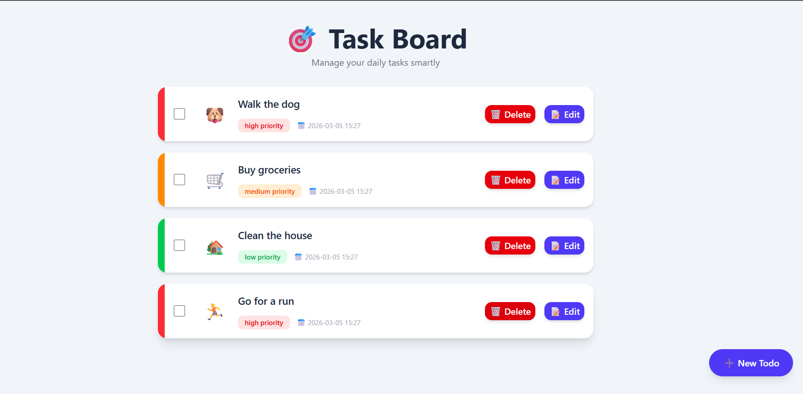

# API Todo Frontend

A clean and responsive Task Board UI for managing daily todos.

## Live UI

## UI

[Open Hosted App](https://apitodofroent.onrender.com/)

## Features

- View all todos in a card-based layout
- Add a new todo with text, priority, and emoji
- Edit existing todos
- Delete todos
- Mark todos as completed/incomplete
- Priority color indicators (`high`, `medium`, `low`)
- Shows created date/time for each todo

## Tech Stack

- React 19
- Vite 7
- Tailwind CSS 4
- React Router DOM 7
- Axios
- emoji-picker-react
